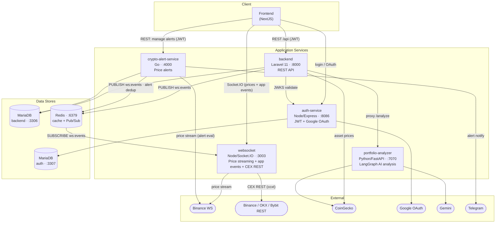
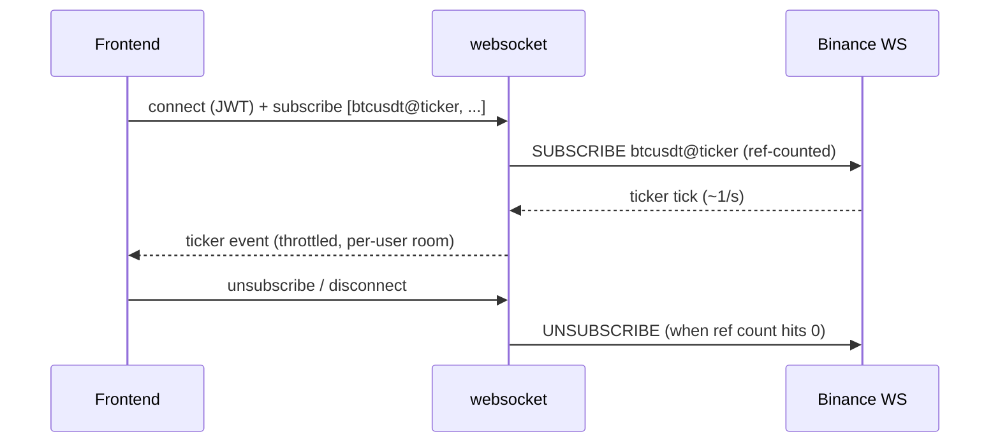
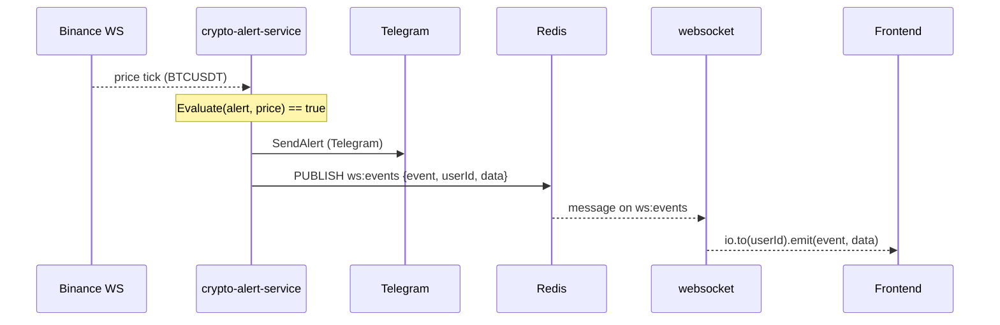

# Architecture

Microservices-based cryptocurrency portfolio, analytics, and alerting platform.

## Services

| Service | Stack | Port | Responsibility |
| --- | --- | --- | --- |
| **backend** | Laravel 11 (PHP 8.2) | 8000 | Main REST API: portfolios, assets, exchanges, transactions. Proxies AI analysis. |
| **auth-service** | Node / Express | 8086 | RS256 JWT issuance, JWKS endpoint, Google OAuth. |
| **websocket** | Node / Socket.IO | 3003 | Binance WS → live price streaming to FE; app-event relay; CEX REST proxy (ccxt). |
| **portfolio-analyzer** | Python / FastAPI + LangGraph | 7070 | AI portfolio analysis (risk, alerts, insights via Gemini). |
| **crypto-alert-service** | Go | 4000 | Own Binance WS feed to evaluate price alerts → Telegram; publishes client events to Redis. |

Infrastructure: MariaDB (backend `:3306`, auth `:3307`), Redis `:6379`(cache + Pub/Sub).

## System diagram

## Realtime flow 1 — live price streaming

The `websocket` service owns the FE price feed. It opens one shared Binance connection and fans ticks out to subscribed clients per-user, throttled.

## Realtime flow 2 — alert fired (Redis Pub/Sub)

The alert-service evaluates alerts against its own Binance feed. When one fires it delivers to Telegram **and** publishes a `ws:events` message; the `websocket` service (the sole subscriber) emits it to the owning user's Socket.IO room. The backend uses the same channel for its own business events.

